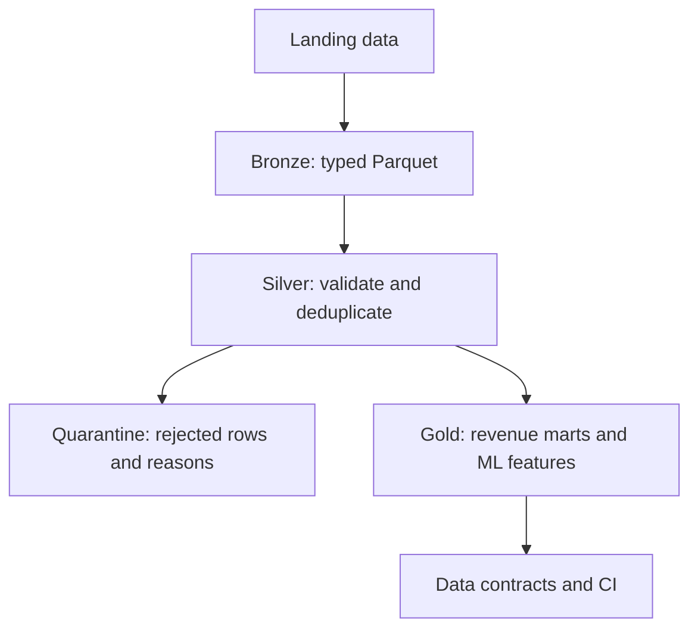

# Spark Ecommerce Lakehouse

[](https://github.com/jojokanand/spark-ecommerce-lakehouse/actions/workflows/ci.yml)


An executable, local-first PySpark project that builds a multi-tenant ecommerce
analytics pipeline from deterministic raw data through Bronze, Silver, and Gold
layers.

The repository also serves as a 16-phase hands-on textbook. Every chapter is
backed by runnable code covering explicit schemas, data-quality quarantine and
reconciliation, joins and shuffle tuning, incremental and streaming workloads,
point-in-time ML features, data contracts, CDC boundaries, and CI validation.

> **Scope:** The project uses Parquet-backed medallion layers so the focus stays
> on Spark execution and data-engineering fundamentals. It does not claim Delta
> Lake or Apache Iceberg transaction semantics.

## What this project demonstrates

- Deterministic, skewed multi-tenant ecommerce data with deliberately injected
  quality failures.
- Typed Bronze ingestion, Silver validation and quarantine, and reconciled Gold
  analytics marts.
- Physical-plan analysis, broadcast joins, shuffle tuning, skew diagnosis,
  salting, partition pruning, and incremental processing.
- Structured Streaming, point-in-time ML feature engineering, CDC modeling, and
  automated data-contract validation.

## Architecture



## Verified scale-1 run

The default deterministic run uses an as-of date of `2026-07-04`.

| Checkpoint | Result |
|---|---:|
| Base orders generated | 100,000 |
| Landing order rows, including duplicates | 100,405 |
| Clean Silver orders | 98,826 |
| Quarantined order rows | 1,579 |
| Silver reconciliation | 98,826 + 1,579 = 100,405 |
| Daily revenue mart rows | 7,375 |
| Customer ML feature rows | 10,000 |
| Data contracts | 10 passed |
| Typical local runtime | 1–2 minutes |

---

## How this repo is organized

```text
book/        the textbook — one chapter per phase
phases/      runnable code — one self-contained folder per phase
docs/        architecture, data model, runbook, and tuning references
scripts/     reproducible end-to-end sample pipeline
data/        generated Bronze, Silver, and Gold data — gitignored
```

Each `phases/phaseNN-*/` folder carries its own copy of `_spark.py` so it can run
independently. Run all commands from the repository root because paths such as
`data/silver/...` are relative to it.

Every phase follows one loop: build a job, run it on realistic data, inspect the
output and physical plan, break it deliberately, fix it, and record the lesson.

## The textbook

| # | Chapter | What you learn |
|---|---|---|
| 0 | [Setup and mental model](book/00-setup.md) | SparkSession, driver/executors, lazy evaluation, actions, transformations, and shuffles |
| 1 | [Generate realistic data](book/01-data-generation.md) | Schemas, cardinality, skew, injected data-quality failures, and reproducibility |
| 2 | [Bronze ingestion](book/02-bronze.md) | Explicit schemas, CSV/JSON to Parquet, column pruning, and predicate pushdown |
| 3 | [Silver cleaning](book/03-silver.md) | Validation, rejection reasons, deduplication windows, quarantine, and reconciliation |
| 4 | [Joins and enrichment](book/04-joins.md) | Composite keys, multi-tenant join traps, SortMergeJoin, and BroadcastHashJoin |
| 5 | [Gold marts](book/05-gold.md) | Multi-key aggregation, wide transformations, and shuffle behavior |
| 6 | [Window functions](book/06-windows.md) | LTV, ranking, `row_number`, `rank`, `dense_rank`, and window versus groupBy |
| 7 | [Partitioning lab](book/07-partitioning.md) | Pruning, small files, `partitionBy`, `repartition`, and `coalesce` |
| 8 | [Plans and the Spark UI](book/08-plans-ui.md) | Logical and physical plans, jobs, stages, tasks, and slow-stage diagnosis |
| 9 | [Performance and skew](book/09-performance.md) | Shuffle partitions, spill, broadcasting, skew diagnosis, and salting |
| 10 | [Incremental processing and backfills](book/10-incremental.md) | Date windows, dynamic partition overwrite, idempotency, and static-overwrite risks |
| 11 | [Structured Streaming](book/11-streaming.md) | File streams, micro-batches, watermarks, output modes, and checkpoints |
| 12 | [ML feature engineering](book/12-ml-features.md) | Point-in-time correctness, leakage, customer features, and product affinity |
| 13 | [Testing and data contracts](book/13-testing.md) | Pytest, invariants, referential integrity, retention, and reconciliation |
| 14 | [Production hardening](book/14-production.md) | Runbooks, job metrics, ownership, SLAs, and regression guards |
| 15 | [OLTP versus OLAP](book/15-spanner.md) | System boundaries, CDC, current-state reconstruction, and serving-layer tradeoffs |
| — | [Appendix: conventions and gotchas](book/appendix-gotchas.md) | Environment setup, function conventions, and recurring Spark pitfalls |

---

## Setup

Requirements:

- Python 3.12
- Java 17 or 21
- [`uv`](https://docs.astral.sh/uv/)

Create the virtual environment and install the exact locked dependencies:

```bash
uv sync --locked
```

Verify that Spark runs locally:

```bash
uv run python phases/phase00-setup/smoke.py
```

## Quickstart

Build and validate the complete scale-1 sample pipeline:

```bash
uv run python scripts/run_sample_pipeline.py
```

The command:

1. Generates a deterministic dataset with 100,000 base orders.
2. Builds typed Parquet Bronze tables.
3. Cleans, deduplicates, quarantines, and reconciles Silver tables.
4. Materializes the daily revenue mart.
5. Builds point-in-time customer ML features.
6. Runs the Phase 13 data contracts.

A complete scale-1 run typically takes 1–2 minutes on a modern laptop. Generated
data is written under `data/` and excluded from version control.

To run the same pipeline with approximately one million base orders:

```bash
uv run python scripts/run_sample_pipeline.py --scale 10
```

Every phase remains directly executable for focused learning; the runner provides
the reproducible end-to-end path used by CI.

## Explore interactively

```bash
uv run python -i phases/phase08-plans-ui/explore.py
```

After the script loads, inspect the prepared DataFrames and physical plans:

```python
daily_revenue.orderBy(F.desc("revenue")).show(5)
```

## The one idea that matters most

`filter` is a **narrow** transformation: each input partition can be processed
without moving data between executors.

`groupBy` and most joins are **wide** transformations. They trigger a shuffle,
shown as `Exchange` in a physical plan, and that network and disk movement is
where Spark jobs often become expensive.

Learning to identify those boundaries turns Spark from a high-level API into a
system you can reason about, measure, and tune.

## License

This project is licensed under the [MIT License](LICENSE).